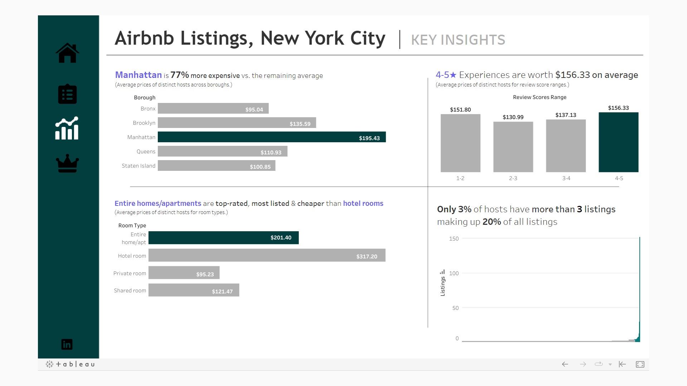
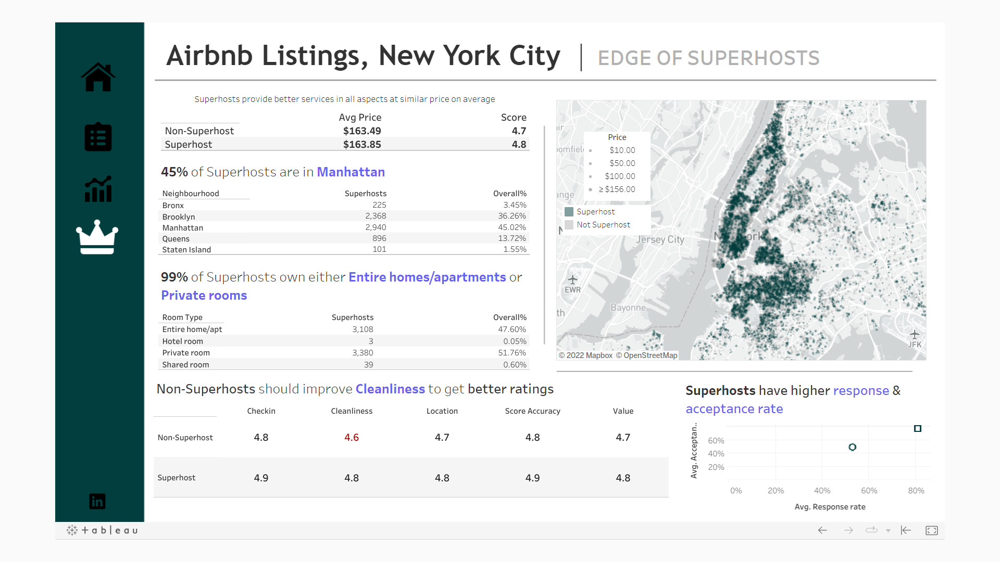

# 🗽 NYC Airbnb Listings – Exploratory Data Analysis

Explore the dynamics of Airbnb listings across New York City through a comprehensive **Exploratory Data Analysis (EDA)**. This project dives into listing patterns, prices, reviews, and host behaviors using tools like **SQL**, **Python**, and **Tableau**, transforming raw data into actionable insights and visual storytelling.

---

## 🔍 Project Overview

This project aims to:
- Understand distribution and trends of Airbnb listings across NYC boroughs.
- Analyze host behaviors, review patterns, pricing, and accommodation types.
- Identify patterns between superhosts and non-superhosts.
- Present insights through interactive visualizations.

---

## 📂 Workflow Breakdown

### 📌 1. Data Exploration & Cleaning
- Explored the dataset using **SQL Server Management Studio (SSMS)**.
- Used **CTEs**, **joins**, **procedures**, and **group by** queries for slicing and dicing the data.
- Performed null handling, duplicate removal, and data type corrections.

### 📌 2. Data Analysis (Q&A)
- Uncovered borough-wise distribution, price analysis, host listings count.
- Analyzed correlations between reviews, ratings, and prices using **Python** (pandas, seaborn, matplotlib).

### 📌 3. Data Transformation
- Prepared clean datasets to feed into **Tableau** for dashboarding.
- Aggregated and grouped data for meaningful visual insights.

---

## 📊 Tableau Dashboard Overview

### 🗺️ Summary Metrics  
- Overview of total listings, average pricing, rating distribution, review counts by **borough**.

---

### 🧭 Filters & Search  
- Interactive filters by **location**, **room type**, **price range**.
- Includes direct links to selected Airbnb listings.

---

### 📌 Key Insights  
- Breakdown of **room types**, **pricing**, and **review patterns**.
- Identification of **top hosts** and **popular neighborhoods**.

---

### 🌟 Superhost Analysis  
- Comparison of **superhosts vs. non-superhosts** on key performance metrics like ratings and reviews.

---

## 🧰 Tech Stack

| Tool       | Purpose                              |
|------------|--------------------------------------|
| **SQL (SSMS)** | Querying & data wrangling             |
| **Python**     | Statistical analysis, visualizations |
| **Tableau**    | Interactive dashboards               |
| **Figma**      | Dashboard planning & layout          |
| **Mapbox**     | Geospatial visualizations            |
| **Excel**      | Data cleanup & validation            |

---

## 📝 Key Learnings

- Translating raw Airbnb data into meaningful business insights.
- Using **SQL** and **Python** for deep data interrogation.
- Creating user-friendly, interactive dashboards with **Tableau**.
- Enhancing communication through data storytelling.

---

