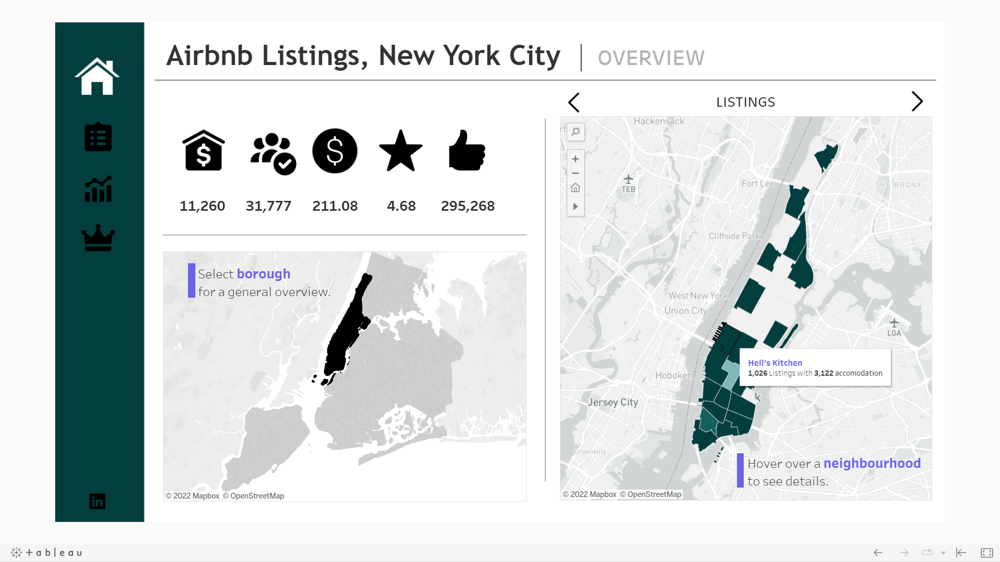
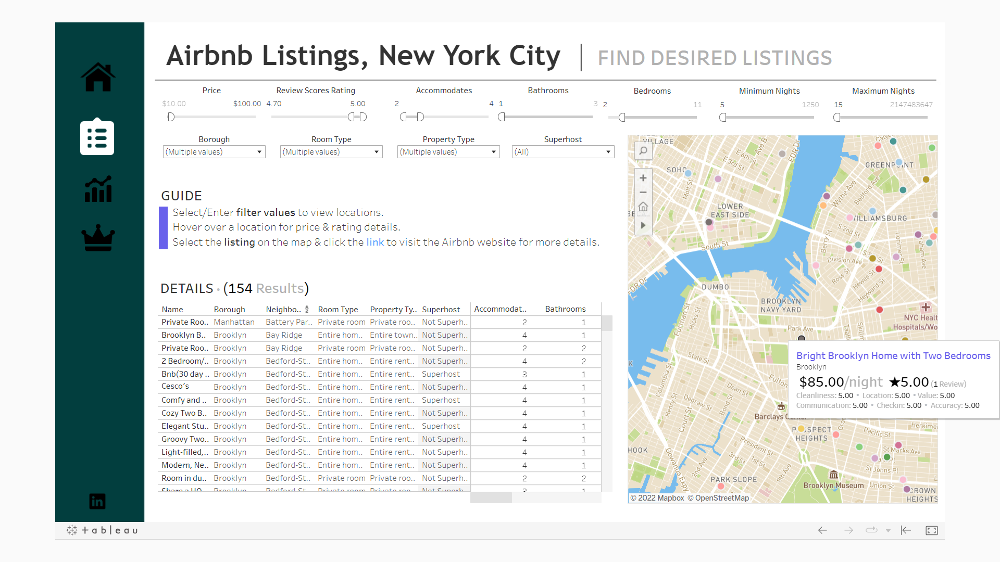
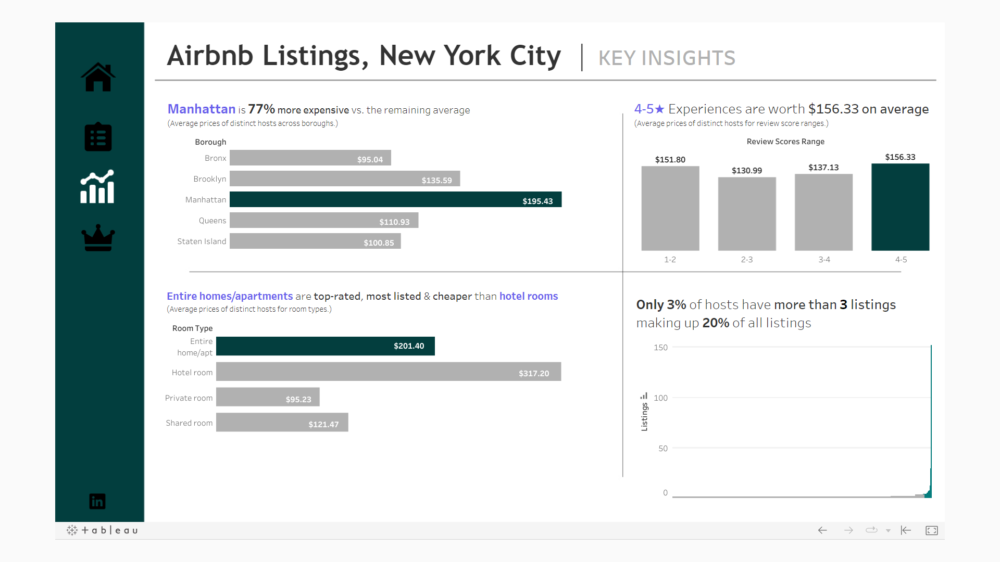
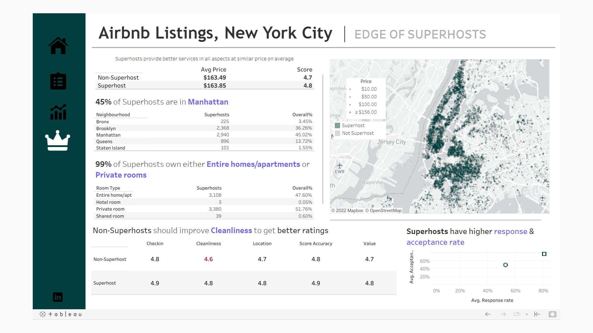

# NYC Airbnb Listings — Exploratory Data Analysis


An end-to-end data analysis of Airbnb listings across New York City, covering data exploration, statistical analysis, and interactive dashboard visualization.

---

## Overview

This project analyzes NYC Airbnb listing data to uncover patterns in pricing, host behavior, room types, and borough-level trends. The workflow spans SQL-based data wrangling, Python-based statistical analysis, and Tableau dashboards for visual storytelling.

---

## Workflow

### 1. Data Exploration & Cleaning
- Queried raw data using **SQL Server Management Studio (SSMS)**
- Applied CTEs, joins, stored procedures, and aggregations for structured exploration
- Handled nulls, removed duplicates, and corrected data types

### 2. Statistical Analysis
- Performed borough-wise distribution, price analysis, and host listing counts
- Analyzed correlations between reviews, ratings, and prices using **Python** (pandas, seaborn, matplotlib)

### 3. Data Transformation
- Prepared aggregated datasets for Tableau dashboarding
- Structured data for geospatial and categorical visualizations

---

## Dashboard

### Summary Metrics
Total listings, average pricing, rating distribution, and review counts by borough.



### Filters & Search
Interactive filters by location, room type, and price range, with direct links to listings.



### Key Insights
Breakdown of room types, pricing trends, and review patterns. Highlights top hosts and popular neighborhoods.



### Superhost Analysis
Comparison of superhosts vs. non-superhosts across ratings, review volume, and pricing.



---

## Tech Stack

| Tool | Purpose |
|------|---------|
| SQL (SSMS) | Data querying and wrangling |
| Python | Statistical analysis and visualization |
| Tableau | Interactive dashboards |
| Mapbox | Geospatial visualizations |
| Excel | Data cleanup and validation |
| Figma | Dashboard layout planning |

---

## Running the Analysis

**Requirements:** Python 3.8+

```bash
pip install pandas numpy matplotlib seaborn openpyxl jupyter
jupyter notebook "Airbnb correlation.ipynb"
```

For SQL queries, open `SQLQuery_Airbnb_NewYork.sql` in SSMS and run against your imported dataset.
